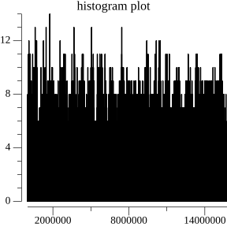
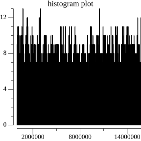
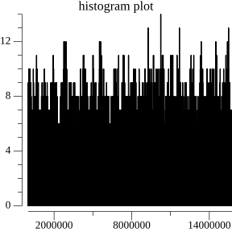
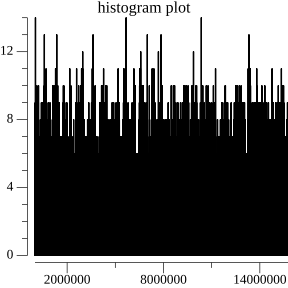
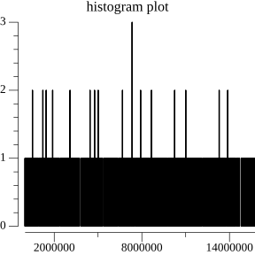
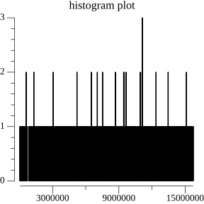
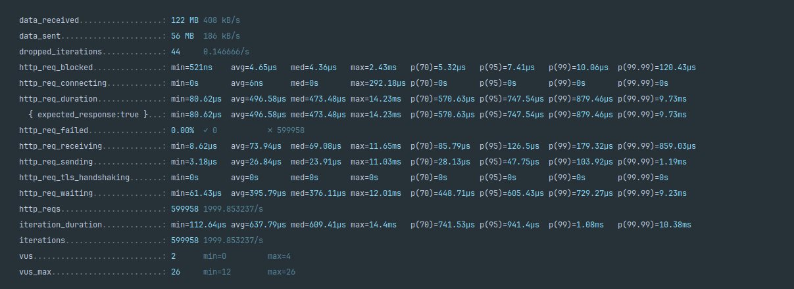
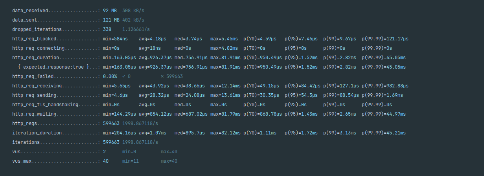
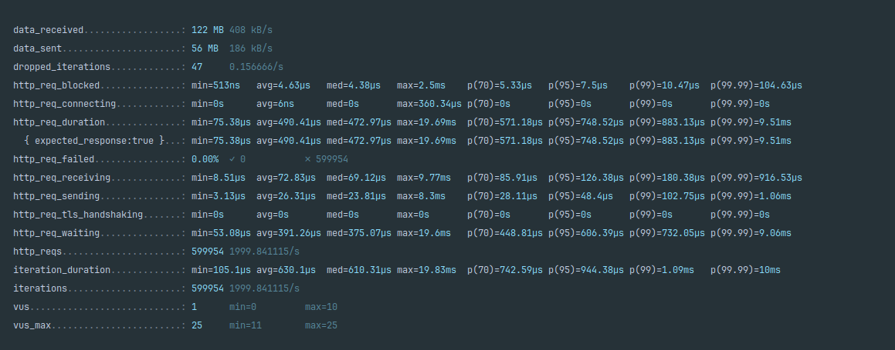
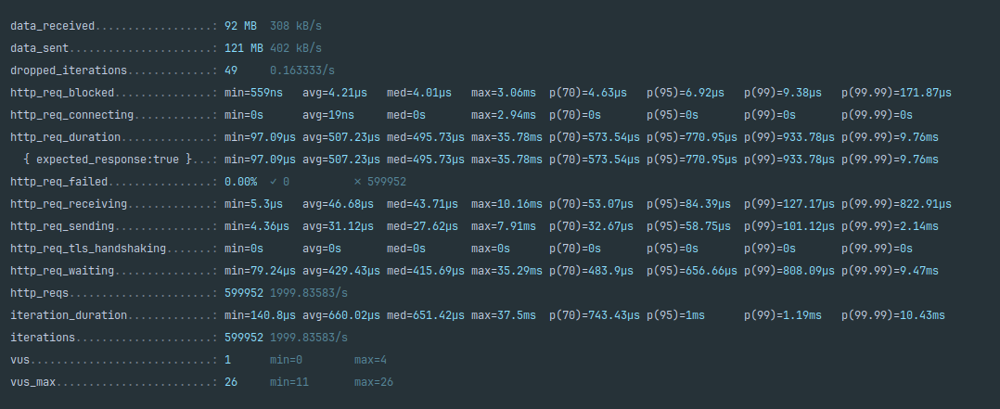

[](https://codecov.io/gh/ThCompiler/smallurl)

# Тестовое задание для стажера-разработчика

Реализовать сервис, предоставляющий API по созданию сокращённых ссылок.

Ссылка должна быть:
* Уникальной; на один оригинальный URL должна ссылаться только одна сокращенная ссылка;
* Длиной 10 символов;
* Из символов латинского алфавита в нижнем и верхнем регистре, цифр и символа _ (подчеркивание).

Сервис должен быть написан на Go и принимать следующие запросы по http:
1. Метод Post, который будет сохранять оригинальный URL в базе и возвращать сокращённый.
2. Метод Get, который будет принимать сокращённый URL и возвращать оригинальный.


***Условие со звёздочкой (будет большим плюсом)***:
* Сделать работу сервиса через GRPC, то есть составить proto и реализовать сервис с двумя соответствующими эндпойнтами

Решение должно соответствовать условиям:
* Сервис распространён в виде Docker-образа;
* В качестве хранилища ожидаем in-memory решение и PostgreSQL. Какое хранилище использовать, 
  указывается параметром при запуске сервиса;
* Реализованный функционал покрыт Unit-тестами.

Результат предоставить в виде публичного репозитория на github.com

## Вопросы и ответы по заданию

### Должен ли сервис при использовании in-memory решения сохранять данные между запусками.

Решено реализовать in-memory решение без сохранения данных между запусками сервера,
т.к. данное требование не удалось уточнить. В качестве хранилища используется `map`.

В случае, если необходимо сохранять состояние между запусками сервера или запустить несколько экземпляров сервиса, имеет
смысл использовать для хранения `Redis`. Тогда достаточно будет заменить текущую реализацию хранилища в памяти на взаимодействие с ним.

### Как лучше сокращать URL?

Решено использовать хэш функцию для сокращения URL. В качестве хэш функции взята `md5`. Были рассмотрены два варианты хэширования:
* Хэширование функцией губкой на основе `md5`, которое позволяет выдавать в результате слово требуемой длины.
* Использование старших 10 байт хэша `md5` для создания 10 символьного результирующего слова.

В папке hash_test реализованы оба варианта и находится исполняемый файл, проверяющий работы этих вариантов на трёх наборах данных:
* Набор из 1000 наиболее частых английских слов.
* Последовательность из 100000 тысяч чисел по порядку.
* Последовательность из 100000 случайно выбранных чисел.

Также необходимо было решить проблему того, что мощность алфавита составляет 63, что не является степень 2 и не позволяет
просто так взять необходимое число бит. В таком случае необходимо брать результат хэширования по модулю 63.
Данное решение приводит к смещению распределения значений хэша к 0. Поэтому получаемое хэш значение проходит 
через простую хэш функцию на основе метода умножения. Такое решение позволяет решить проблему смещения распределения.

По итогу тестов оба варианта хэш функций показали схожие результаты:

**Последовательность из 100000 тысяч чисел по порядку:**

| Простая                                      | Функция губка                                |
|----------------------------------------------|----------------------------------------------|
|  |  | 

**оследовательность из 100000 случайно выбранных чисел:**

| Простая                                      | Функция губка                                |
|----------------------------------------------|----------------------------------------------|
|  |  | 

**Набор из 1000 наиболее частых английских слов:**

| Простая                                     | Функция губка                               |
|---------------------------------------------|---------------------------------------------|
|  |  | 


Поэтому решено остановиться на более простой функции, т.к. она будет работать быстрее функции губки.

## Общее описание решения

- Сервис реализован на языке `Golang` версии `1.22`.
- В качестве web фреймворка используется [gin](https://github.com/gin-gonic/gin).
- Логирование операций в файл в папку `/app-log`, настраиваемое в файле конфигураций.
- Реализованы `Middlewares` для: отслеживания паники, логирования.
- Сервис поднимается в `Docker` контейнерах: хранилища Redis, основное приложение.
- Контейнеры конфигурируются в  `docker-compose`. Для сборки сервиса используется multi-stage сборка в `Docker`.
- В качестве СУБД используется `PostgreSQL`. В качестве библиотеки для работы с запросами к `PostgreSQL` используется
  [pgxpool](https://github.com/jackc/pgx).
- API задокументировано с использованием Swagger по адресу `http://localhost:8080/api/v1/swagger/`. 
  Файл с API находится в папке docs.
- Все методы имеют префикс `/api/v1`.
- Взаимодействие с проектом организовано посредством `Makefile`.
- Тесты реализованы с помощью библиотеки [allure-go](https://github.com/ozontech/allure-go).
- Подключен `Github Actions` для проверки стиля, тестирования и сборки приложения.

## Инструкция по запуску:

### Исполняемый файл сервиса smallurl

Описание аргументов командной строки при работе с исполняемым файлом сервиса баннеров.

***Использование:***
```bash
server [-c=<file> | --config=<file>] [-h | --help]
````

***Опции:***
```bash
   -c --config=<file> - путь к файлу с конфигурациями (по умолчанию путь до локальной конфигурации (./configs/localhsot-config.yaml)).
   -h --help - выводит список допустимых опций и их описание.
```

### Конфигурационный файл

Все конфигурационные файлы находятся в папке `config`. Файлы `docker-config.yaml` и `localhost-config.yaml` 
являются файлами конфигурации сервиса для запуска в боевом окружении в Docker и для локального запуска вне Docker контейнера.

Папка `env` содержит файл с переменными среды для запуска docker compose.

Конфигурационный yaml файл имеет следующие поля:
```yaml
mode: release # Режим запуска системы
use_in_memory: false # Указывает использовать ли в качества хранилища in-memory решение или нет
http: # настройки http сервера
  port: 8080 # Порт grpc сервера
grpc: # настройки grpc сервера
  port: 6345 # Порт grpc сервера
  hostname: 0.0.0.0 # Прослушиваемый ip для grpc сервера
postgres: # Настройки подключения к PostgreSQL 
  url: "host=banner-bd port=5432 user=intern password=fyr8as4da6 dbname=banner_db sslmode=disable" # Строка подключения к базе PostgreSQL
  max_connections: 10 # Максимальное число активных соединений к PostgreSQL
  min_connections: 5 # Минимальное число активных соединений к PostgreSQL
  ttl_idle_connections: 100 # Время, на протяжении которого сохраняется бездействующее соединение сверх их ограничения
logger: # Настройки логгера
  app_name: "smallurl" # Имя приложения, будет выводиться в лог
  level: 'info'  # Минимальный уровень вывода информации в лог
  directory: './app-log/' # Папка куда сохранять логи
  use_std_and_file: false # Если установлено в true, то лог будет выводиться как в файл так и в stdErr
  allow_show_low_level: false # Если установлено в true и use_std_and_file тоже true, то в stdErr будет выводиться лог всех уровней
```

Переменные среды docker compose:
*`POSTGRES_PASSWORD=fyr8as4da6` -- Пароль для базы данных PostgreSQL
*`POSTGRES_USER=intern`  -- Пользователь для базы данных PostgreSQL
*`POSTGRES_DB=url_db` -- Название базы данных PostgreSQL

Существует четыре режима работы:
* `release` -- Запуск в режиме релиза (влияет на запуск gin в режиме Release).
* `debug` -- Запуск в режиме отладки (влияет на запуск gin в режиме Debug).
* `debug+prof` -- Запуск как в режиме `debug`, но с подключением профилирования.
* `release+prof` -- Запуск как в режиме `release`, но с подключением профилирования.

**Все поля обязательны.**

### Сборка контейнера с веб-сервисом

Теперь необходимо собрать докер образ с веб-сервисом:

```bash
make build-docker
```

После запуска команды на сборку докер образа появятся образ `smallurl`, который поддерживает env переменную 
`CONFIG_PATH`, которая позволяет установить путь до конфигурационного файла в аргумент `--config` запускаемого сервиса.

### Запуск всей системы

Для запуска необходимо выполнить следующую команду:

```bash
make run
```

Если необходимо запустить docker-compose не в режиме демона, то можно выполнить следующую команду:

```bash
make run-verbose
```

Система запущена. Сервер доступен на http://localhost:8080/.

Api можно посмотреть и запускать на http://localhost:8080/api/v1/swagger/index.html.

### Остановка

Для остановки с сохранением контейнеров необходимо выполнить следующую команду:

```bash
make stop
```

Для полной остановки необходимо выполнить следующую команду:

```bash
make down
```

### Дополнительно

#### Тесты

Дополнительно были реализованы юнит-тесты на основные элементы сервиса. Для их запуска следует выполнить следующую команду:

```bash
maker run-tests
```
Для тестов использовалась библиотека [allure-go](https://github.com/ozontech/allure-go), которая генерирует отчёт по 
выполненным тестам. Для его просмотра необходим выполнить следующую команду

```bash
make run-report
```

Отчёты можно очистить с помощью команды:

```bash
make clear-reports
```

Для запуска тестов с расчётом покрытия необходимо выполнить команду:

```bash
make run-coverage
```

#### Линтеры

Была собрана конфигурация линтера в файле `.golangci.yml` для утилиты [golangci-lint](https://golangci-lint.run/).
Для запуска проверки линтера необходимо запустить команду:

```bash
golangci-lint run
```
Предварительно `golangci-lint` необходимо установить.


#### Нагрузочное тестирование

Для проверки работоспособности сервиса при нагрузке были запушены нагрузочные тесты на http методы.

Для тестирования использовалась утилита [Grafana k6 documentation](https://grafana.com/docs/k6/latest/).

Тесты запускались командами:

* Проверка получения оригинального URL (предварительно добавлены пути в базу).
```bash
k6 run --summary-trend-stats "min,avg,med,max,p(70),p(95),p(99),p(99.99)" ./test/load_test/test.js -e METHOD=get -e RATE_COUNT=2000
```

* Проверка создания короткого URL.
```bash
k6 run --summary-trend-stats "min,avg,med,max,p(70),p(95),p(99),p(99.99)" ./test/load_test/test.js -e METHOD=post -e RATE_COUNT=2000
```

Система была проверена под нагрузкой 2000 запросов в секунду. Получились следующие результаты:

**Для хранилища PostgreSQL:**

| Get                                         | Post                                         |
|---------------------------------------------|----------------------------------------------|
|  |  | 


**Для in-memory хранилища:**

| Get                                       | Post                                       |
|-------------------------------------------|--------------------------------------------|
|  |  | 

По итогам тестов система показала хороший результат в 45,05 ms для 99,99 процентиля на POST запрос при работе с PostgreSQL.
Остальные запросы составили около 7 ms для 99,99 процентиля, что является отличным результатом.

Т.к. не известные конкретные требования к времени ответа и нагрузке, тесты проводились с целью посмотреть как в целом 
работает сервис при достаточно большой нагрузке.
